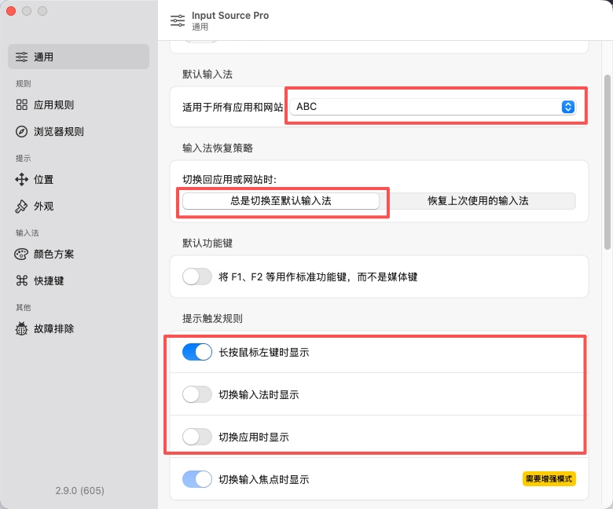
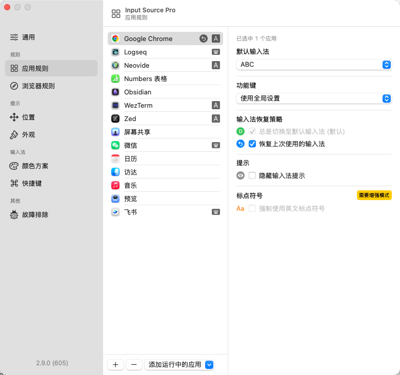

# Input Source Pro 配置说明

Input Source Pro 是一个 macOS 输入法自动切换工具。

## 安装方法

使用 Homebrew 安装：

```bash
brew install --cask input-source-pro
```

## 界面设置





## 隐藏顶部语言栏（可选）

如果想隐藏 macOS 顶部的语言指示栏（显示当前输入法的那个），可以执行以下命令并注销重新登录：

```bash
defaults write kCFPreferencesAnyApplication TSMLanguageIndicatorEnabled 0
```

注销重新登录后生效。
